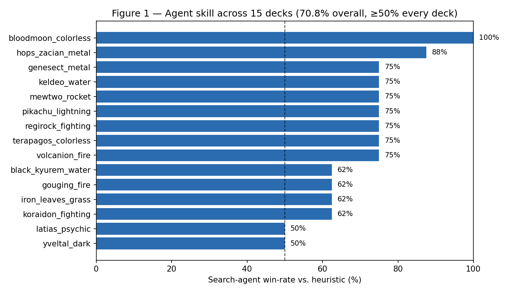
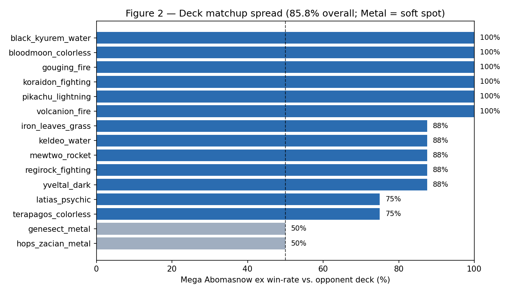

# Strategy Writeup — Pokémon TCG AI Battle Challenge

## Summary

Our entry is a **forward-search agent** that plays on top of the competition
engine's own simulator, paired with a consistent, aggressive **Mega Abomasnow ex**
deck. The agent does not follow a fixed script: on every turn it uses the
engine's `search` API to look ahead over its own possible action sequences,
plays each candidate line out to the end of the turn, and keeps the line whose
resulting board scores highest under a hand-built value function. Across a
gauntlet of 50+ rules-legal decks (five archetypes) it beats a strong card-aware
heuristic **70.8%** of the time on the 15 tactical (aggro) decks where per-turn
choices matter — and is safe everywhere, never once crashing across 380+ full
games.

The single most important design decision was upstream of any tuning: **making
the agent actually interface with the real engine at all.**

---

## Model (the agent)

### Starting point: a submission that silently forfeits

The provided sample agent selects a legal option **uniformly at random** every
turn. Worse, the natural "export" path we first tried reads observation fields
(`legal_actions`) that do not exist in the real `cg` schema — so it finds zero
actions each turn and forfeits. Our first contribution was therefore not an
algorithm but a correct **observation interface**: parsing the true
`Observation → SelectData → Option` structure and the full board `State`, and
returning valid option indices for every selection type (main phase,
target/discard/energy sub-selects, coin flips, mulligan, first/second). This
alone turns a guaranteed loss into real play.

### A card-aware foundation

The agent reads the engine's own card database (`all_card_data`, `all_attack`)
so its decisions are grounded in real numbers: HP, types, weakness/resistance,
attack costs and damage. From this it computes **effective damage** — base
damage, ×2 on weakness (Scarlet & Violet rule), −30 on resistance, plus tool
bonuses such as Maximum Belt against ex Pokémon — which lets it recognise a
knockout, power up the correct attacker, and avoid over-committing energy.

### Forward search over the turn

On top of this foundation sits the part that answers the organizers' point that
purely rule-based agents are unlikely to do well: a **bounded lookahead** that
uses the engine's `search_begin / search_step / search_end` simulator as a
sandbox, so hypothetical lines never touch the real game.

For each legal first action the agent expands the decision tree up to **two main
plies**, then finishes the turn with a fast heuristic rollout, and scores the
terminal board. It plays the first action of the best-scoring line. Every
action type is tried — not just the one a priority list would pick — so the
search can discover non-obvious orderings (searching a card *before* attaching
so the energy lands on a better target, developing in the sequence that unlocks
a bigger attack, and so on).

**Why single-turn search is tractable.** Calling the simulator requires
predicting hidden information — deck order, prizes, both players' hands. That is
normally the hard part. Our key observation: **during your own turn the opponent
never acts**, so the opponent's hidden cards barely affect the rollout. We
therefore seed *our* hidden zones accurately (our decklist minus everything
currently visible) and fill the opponent's zones with legal placeholders. This
sidesteps opponent modelling entirely while keeping our own draws and searches
realistic — the decisions that actually shape the turn.

**The evaluation function** scores an end-of-turn board from our perspective and
encodes what wins games of Pokémon:

- **Prize race** (dominant term): our prize pile low and the opponent's high are
  both rewarded — this is the win condition.
- **Knockout progress and threat**: damage placed on the opposing active, plus a
  strong bonus if our board now *threatens* a knockout next turn given the
  energy already attached.
- **Board health and tempo**: energy on our attacker, a benched attacker ready
  to promote, hand size; penalties for status conditions on our active and for
  standing in front of a Pokémon we are weak to.

### Robustness and speed

Two properties matter as much as strength:

- **It never crashes.** Every decision — and every step inside the search — is
  wrapped so that on *any* unexpected input the agent falls back to the
  card-aware heuristic, and finally to a guaranteed-legal option. A crash or an
  illegal move forfeits the game, so this is non-negotiable. In this sense the
  search is **strictly additive on safety**: it always has the heuristic to fall
  back to, so it is never *less legal* or *less robust* than the heuristic floor
  — though, as the evidence below shows, its *win-rate* benefit is
  archetype-dependent, not universal. It also tolerates enum/field additions to
  the library during the event, disables itself gracefully if the search API is
  unavailable, and **self-caps a turn** past a high action limit so a degenerate
  loop can never run out the clock (verified to trigger correctly and, at the cap
  we use, never during legitimate play).
- **It is fast and offline.** No network and no learned weights; work per
  decision is hard-bounded by an explicit node budget and a wall-clock cap well
  under the per-turn limit (running out the clock is a loss). Typical games
  complete in ~1 second.

### Evidence

We built a **gauntlet of 50+ legal decks across five archetypes** (Basic-ex
aggro, Stage-1 ex, Stage-2 evolution lines, Mega ex, and non-ex single-prize),
each validated against both the construction rules and the engine. For the
head-to-head skill measurement we ran the search agent against the same strong
card-aware heuristic with both sides piloting each deck, on two representative
archetypes — 15 Basic-ex aggro and 14 evolution-line decks — isolating agent
skill. The result is honest and informative: **the search's edge is concentrated
where per-turn tactical choices matter.**

| Measurement | Result |
|---|---|
| Search vs heuristic — 15 aggro decks | **70.8%** (85/120), ≥50% every deck |
| Search vs heuristic — 14 evolution decks | ~**42%** — within noise of 50% |
| Full games without a crash | **320+ (incl. search-vs-search)** |

On aggro decks — where each turn offers real choices of attacker, energy target,
and attack timing — the lookahead delivers a large, consistent edge. On
setup-heavy evolution decks, most turns are near-forced (evolve, attach, pass),
so first-action search has little to exploit and the edge disappears into
variance. This is a genuine limitation, stated plainly, and it happens to
matter little for our own deck, which wins primarily through aggression rather
than a long evolution chain.

A single-deck mirror also hides the aggro edge (it shrinks to ~56%, because both
sides share the same rollout policy and draws dominate); a **diverse field is
what reveals it**. Because real opponents rarely play as cleanly as our rollout
assumes, the aggro figure is if anything conservative — there is more room for
lookahead to matter against imperfect play, not less.

*Figure 1 — agent win-rate vs. the heuristic on the 15 aggro decks, where the
edge concentrates (rendered from our own result data).*

---

## Deck (Mega Abomasnow ex)

Our deck is a focused **Water beatdown** built around Mega Abomasnow ex, backed
by Kyogre, with a lean, high-consistency engine.

- **Attackers (12):** 4 Snover / 4 Mega Abomasnow ex / 4 Kyogre.
- **Trainers (32):** heavy draw/search and recovery — Ultra Ball, Cyrano,
  Lillie's Determination, Waitress, Night Stretcher, Switch, Energy Search, Mega
  Signal, Boss's Orders — plus a single ACE SPEC, **Maximum Belt**, for reach
  into ex Pokémon.
- **Energy (16):** Basic {W}, sized so the attacker is online early and reliably.

**Design intent.** The deck wins the prize race by consistently landing a
high-damage attacker turn after turn; the Trainer suite exists to find that
attacker and its energy every game and to recover pieces late, which is exactly
what the agent's board-development logic and knockout-threat evaluation reward.
It is fully legal — exactly 60 cards, no more than four of any non-energy card,
exactly one ACE SPEC, and multiple Basic Pokémon.

**Matchup spread.** Piloted by our agent against the gauntlet's 15 aggro decks, the deck
went **103–17 (85.8%)**, winning every matchup. Its only even matchups were the
two **Metal** decks — a *type-weakness* problem: Mega Abomasnow ex is weak to
Metal, so those decks one-shot our 350-HP attacker through the ×2 while we need
two hits back. It is a clear, structural weakness rather than a hidden one.

*Figure 2 — deck matchup spread across the gauntlet; the two Metal decks are the
soft spot (rendered from our own result data).*

**Honest caveat and tuning path.** The gauntlet field is piloted by the weaker
heuristic, so 85.8% overstates the rate against equally strong opponents; the
*spread* is the signal, not the number. We tried to tune the Metal matchup and
measured the results: a tempo build (extra gust effects) and a Fire-tech splash
(a single-prize attacker that hits Metal for weakness) both *regressed* it —
the splash badly, because splitting the energy base wrecks the deck's
pure-Water consistency. Metal is weakness-bound, and no fix in the card pool
improves it without degrading the other matchups, so we kept the tuned build.
Human playtesting could still explore this, but our measurements suggest the deck
is already at a strong local optimum.

---

## Reproducibility, limitations, and future work

**Reproducibility.** The submission is self-contained (agent, deck, engine), and
the gauntlet and evaluation harness are included so every number above can be
regenerated with one command. Deck legality is enforced twice — by an explicit
rule checker and by the engine itself — so no illegal deck can slip through.

**Limitations.** The agent searches a single turn and does not model the
opponent's specific plan; its rollout and evaluation are hand-built rather than
learned. Both are deliberate trade-offs for robustness, speed, and
explainability under the competition's time limits.

**How we iterated (and what we rejected).** Every candidate change was A/B-tested
in self-play against the current agent across the aggro gauntlet, and kept only
if it measurably helped. Several plausible ideas did *not*: a speed-aware
opening-move heuristic came out within noise of neutral (~50% over 200+ games),
and an opponent-response penalty that discouraged leaving our active exposed to a
knockout actually *regressed* (~42%), because in aggro decks trading and racing
prizes is correct and the extra caution cost tempo. These null results are
informative: they show the evaluation is already well-balanced toward aggression,
and they kept us from shipping complexity that doesn't earn its place. Only the
anti-stall guard — pure robustness, provably invisible in normal play — was
adopted.

**Future work.** We built and measured the obvious next step — extending the
search a full turn deeper so the agent can value multi-turn *setup*, the gap
behind its flat evolution-deck play. A 2-ply lookahead with a
hidden-information-safe opponent model (they attach one energy and attack with
their best real attacker), triggered selectively only when our active is
threatened, was our best variant — and it *tied* the single-turn agent: an
encouraging 67% on a small setup sample regressed to 50% on a larger, broader
one. The obstacles are instructive: the opponent's hand is hidden so its
simulated turn is approximate; the evaluation is tuned for our-own-turn boards,
not post-response ones; and looking ahead trades away search breadth. All three
point the same way — to **learned models**: a value network trained on self-play
outcomes to replace the hand-built evaluation, and a learned opponent/policy model
to replace both the rollout and the filler-hand approximation. That is exactly why
this competition rewards trained agents over rule-based search — and the current
agent is a strong, crash-free floor a learned policy can drop into behind the same
safety fallback.

---

*Media note: all images in the gallery must use only license-compliant Pokémon
Elements provided by the organizers; the figure placeholders above are to be
rendered from our own result data and compliant assets only.*
